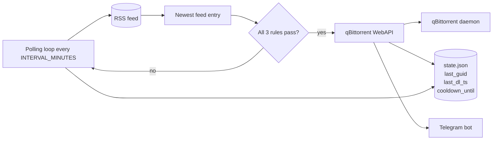

# RatioKing

**I built this app specifically for building up ratio quickly on new private torrent trackers using freeleech torrents** but it can be used for downloading anything via RSS.

**Automated RSS‑to‑qBittorrent downloader** with three-rule logic, containerised in a lightweight multi-stage **distroless Docker image** (about 21 MB) for improved security ([Docker hub repo](https://hub.docker.com/r/battermanz/ratioking))

> **Disclaimer:** this tool was 100% vibe-coded, then hardened for production. It only makes outbound calls (RSS + qBittorrent WebAPI) and does not require any open inbound ports.

---

## Table of Contents

* [Features](#features)
* [Architecture](#architecture)
* [Requirements](#requirements)
* [Configuration](#configuration)
* [Setup & Installation](#setup--installation)
* [Running Locally](#running-locally)
* [Docker](#docker)

  * [Building the Image](#building-the-image)
  * [docker-compose](#docker-compose)
* [Logging & State](#logging--state)
* [Telegram Notifications](#telegram-notifications)
* [Security Notes](#security-notes)
* [Customisation](#customisation)
* [Troubleshooting](#troubleshooting)
* [License](#license)

---

## Features

* Polls a torrent RSS feed at configurable intervals.
* Use with a freeleech RSS torrent feed to build your ratio on a new private tracker!
* Applies three rules before downloading:

  1. Skip if the torrent GUID was already processed.
  2. Skip if the torrent is older than 10 minutes for maximum freshness and opportunity to seed.
  3. Skip if a download occurred too recently (cooldown derived from torrent size ÷ configured download speed, fallback 2 h).

  The cooldown enforces **one torrent at a time** so the available bandwidth goes to seeding what you just grabbed, improving ratio performance.
* Optional Telegram notification when a torrent is added.
* Downloads new torrents via the qBittorrent WebAPI with custom parameters (save path, category, tags, share ratio, seeding time).
* Logs actions and reasons for skips with clear text markers.
* Persists state in a JSON file (last GUID and timestamp).
* Configurable entirely via environment variables or a `.env` file.
* Containerised using a minimal multi-stage distroless Docker image (~21 MB) for a smaller attack surface.

---

## Architecture



1. The script runs in a loop (every `INTERVAL_MINUTES`).
2. It loads `state.json` to check last download GUID and cooldown.
3. It fetches the RSS feed, picks the newest entry, and applies the three rules (duplicate, freshness, cooldown).
4. If all pass, it calls the qBittorrent WebAPI to add the torrent with configured options.
5. It updates `state.json` and logs the actions.

---

## Requirements

* Python 3.11+
* `feedparser` (RSS parsing)
* `requests` (HTTP client)
* `python-dotenv` (optional, for `.env` loading)

*On Docker, everything is packaged—no host Python needed; the image ships with Python 3.11 distroless.*

---

## Configuration

Copy the provided `.env.example` to `.env` and fill in your values:

```dotenv
# qBittorrent API endpoint
QB_URL=http://localhost:8080

# qBittorrent WebUI credentials
QB_USER=user
QB_PASS=password

# Your torrent RSS feed
RSS_URL=https://url.com

# Script options
INTERVAL_MINUTES=5
LOG_FILE=./logs/ratioking.log
# STATE_FILE=./ratioking.state.json   # optional custom path
DOWNLOAD_SPEED_MBPS=10               # Size / speed = cooldown duration
TELEGRAM_BOT_TOKEN=                  # Optional: send alerts via Telegram
TELEGRAM_CHAT_ID=                    # Optional: recipient chat ID
# HTTP_TIMEOUT=20                    # Seconds; applies to RSS and torrent fetches
# MAX_TORRENT_BYTES=5242880          # Safety cap for torrent file prefetch
# USER_AGENT=ratioking/1.0           # Override if your feed requires it

# Download parameters
SAVE_PATH=/mnt/path/
CATEGORY=category
TAGS=tags
RATIO_LIMIT=-1           # -1 = unlimited ratio
SEEDING_TIME_LIMIT=-1    # Minutes; -1 = no time limit
```

Each variable has a sensible default if not set.

---

## Setup & Installation

1. **Clone** the repository:

   ```bash
   git clone https://.../ratioking.git
   cd ratioking
   ```
2. **Create** a Python virtual environment (optional for local runs):

   ```bash
   python3 -m venv .venv
   source .venv/bin/activate
   ```
3. **Generate** `requirements.txt` automatically:

   ```bash
   pip install feedparser requests python-dotenv
   pip freeze --local > requirements.txt
   ```
4. **Copy** configuration:

   ```bash
   cp .env.example .env
   # Edit .env with your values
   ```

---

## Running Locally

```bash
# Activate venv if used
source .venv/bin/activate

# Install deps
pip install -r requirements.txt

# Run the downloader
python ratioking.py
```

Logs appear on stdout and in `LOG_FILE`. Press `Ctrl+C` to stop.

---

## Docker

### (optional) Building the Image

```bash
docker build -t ratioking:latest .
```

### docker-compose

Use the provided `docker-compose.yml` (matching the distroless image and bind mounts, [Docker hub repo](https://hub.docker.com/r/battermanz/ratioking)):

```yaml
services:
  ratioking:
    image: battermanz/ratioking:latest
    env_file:
      - .env
    environment:
      TZ: Europe/Amsterdam
      STATE_FILE: /app/data/ratioking.state.json
      # Optional: run as host UID/GID to avoid bind-mount permission issues
      # PUID: "1000"
      # PGID: "1000"
    volumes:
      - ./logs:/app/logs
      - ./data:/app/data     # persists cooldown/last GUID across restarts
    restart: unless-stopped
```

Launch:

```bash
docker-compose up -d
```

---

## Logging & State

* **Logs:** stdout (captured by Docker logs) and file (`LOG_FILE`).
* **State:** JSON in `STATE_FILE`:

  ```json
  { "last_guid": "<torrent GUID>", "last_dl_ts": 168XYZ }
  ```

* **Cooldown:** derived from torrent size ÷ `DOWNLOAD_SPEED_MBPS` (fallback 2 h) to ensure only one torrent downloads at a time and the link is freed quickly for seeding.

---

## Telegram Notifications

* Optional; disabled unless both `TELEGRAM_BOT_TOKEN` and `TELEGRAM_CHAT_ID` are set.
* Configure in `.env` or `docker-compose.yml`:

  ```dotenv
  TELEGRAM_BOT_TOKEN=123456:ABC...
  TELEGRAM_CHAT_ID=123456789
  ```

* Bot setup: create a bot with BotFather, copy the token, and use your chat ID (or the ID of the group the bot is in).
* The app sends an HTML-formatted message when a torrent is added. Example:

  ```
  📥 Added torrent

  Natsumes Book of Friends S02 1080p CR WEB-DL Dual-Audio AAC 2 0 x264-Fool

  Size: 1.20 GB
  Cooldown: 45.0 min
  Ends: 2025-12-09 16:45:36
  ```

If credentials are missing or Telegram rejects the call, the downloader continues without notifications.

---

## Security Notes

* Distroless runtime (Python 3.11) for a minimal attack surface; no shell or package manager in the final image.
* Non-root container by default (configurable via `PUID`/`PGID` in compose) to align file permissions with host binds.
* Outbound-only design: talks to RSS and qBittorrent WebAPI; no inbound ports exposed by this service.
* TLS-capable HTTP client with configurable `HTTP_TIMEOUT` and `MAX_TORRENT_BYTES` to avoid hanging or oversized torrent fetches.
* Torrent prefetch size cap (default 5 MB) and required http/https schemes for torrent URLs to avoid unsafe protocols.
* Atomic state writes and resilient state loading to reduce corruption risk.
* Optional Telegram notifications use HTTPS; they are skipped if not configured.

---

## Customisation

* Change timing constants in code for different intervals.
* Tweak download options via `.env` without code changes.
* Use a different RSS feed by updating `RSS_URL`.

---

## Troubleshooting

* **Skipping too much?** Check logs for which rule is firing (duplicate, freshness, cooldown).
* **API errors?** Validate credentials and test `curl` against `QB_URL`.
* **Feed issues?** Run `rss_debug.py` to inspect feed structure.
* **Docker build fails?** Ensure `requirements.txt` is up to date.

---

Enjoy your automated downloads.

---

## License

GPL-3.0-or-later. See `LICENSE`.
